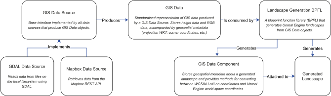

LandscapeGen
============

This plugin allows users to generate landscapes from GIS data inside the Unreal Editor, leveraging the [GDAL/OGR](https://gdal.org/) API via the [UnrealGDAL](https://github.com/TensorWorks/UnrealGDAL) plugin. The following features are provided:

- Supports generating landscapes in the Unreal Editor, which are then saved as regular assets that can be used in packaged projects.
- Supports importing GIS data through both GDAL and [Mapbox](https://www.mapbox.com/).
- Provides a [pluggable architecture](#plugin-architecture) so that developers can provide their own data source implementations.
- Provides functionality to convert between geospatial coordinates and Unreal Engine worldspace coordinates.
- Supports custom scale factors when generating landscapes.

Please note the following limitations in the current implementation:

- Landscapes can only be generated in the Unreal Editor, they cannot be generated at runtime. Generated landscapes are usable at runtime but still rely on the runtime modules from this plugin to provide coordinate conversion functionality.
- Only one landscape can be generated at a time, and each generated landscape is independent. Automatically tiling multiple landscapes to create a seamless large-scale environment is not supported.
- Importing GIS data through the GDAL data source is limited to the file formats supported by the UnrealGDAL plugin (which is effectively just GeoTIFF files in the current release.)

## Installation

To use the LandscapeGen plugin in an Unreal Engine project, you will need to do the following:

- Download the precompiled binaries for the [latest release of the UnrealGDAL plugin](https://github.com/TensorWorks/UnrealGDAL/releases) and place the `UnrealGDAL` folder inside your project's `Plugins` directory.
- Download the source code for the LandscapeGen plugin and place the `LandscapeGen` folder inside your project's `Plugins` directory.
- Ensure both plugins are enabled in your project's settings.

Demo Editor Utility Widgets are provided in the [Examples content folder](./Content/Examples) and can be used to test the plugin's functionality. Widgets are provided for generating landscapes using both the GDAL and Mapbox data sources, and also for converting between geospatial coordinates and Unreal Engine worldspace coordinates. **Note that conversion results when using the example Widget will be inaccurate due to floating-point precision issues when using UMG text input elements, but the underlying functions will produce accurate results when accessed directly from C++ or Blueprints. The example Widget also only supports performing coordinate conversion for a single landscape and will not function correctly if there are multiple generated landscapes in a map.**

## Plugin architecture

The plugin is composed of four modules:

- [LandscapeGenRuntime](./Source/LandscapeGenRuntime): provides the functionality required at runtime to perform coordinate transformation. This consists of the [UGISDataComponent](./Source/LandscapeGenRuntime/Public/GISDataComponent.h) class, which is attached as a component of all generated landscape assets.

- [LandscapeGenEditor](./Source/LandscapeGenEditor): provides the Editor-only functionality for generating landscapes, and defines the key classes and interfaces used by data source implementations.

- [GDALDataSource](./Source/GDALDataSource): provides a data source implementation that uses the GDAL/OGR API to load GIS data from files on the local filesystem.

- [MapboxDataSource](./Source/MapboxDataSource): provides a data source implementation that uses the Mapbox REST API to retrieve GIS data.

The relationships between the core classes and interfaces of the plugin's modules are depicted below:

- [IGISDataSource](./Source/LandscapeGenEditor/Public/GISDataSource.h): this is the interface that needs to be implemented by all data sources providing input data to the landscape generation system. It consists of a single method called `RetrieveData()` which is expected to asynchronously perform data retrieval and then signal success or failure by invoking the appropriate callback. The callbacks for both success and failure have the same function signature, which takes an [FString](https://docs.unrealengine.com/en-US/API/Runtime/Core/Containers/FString/index.html) parameter indicating an error message and an [FGISData](./Source/LandscapeGenEditor/Public/GISData.h) parameter containing the retrieved data. In the event of a failure, the error message should be non-empty and the data object should be empty, and in the event of success the error message should be empty and the data object should be fully populated. The use of two separate callbacks with identical signatures (rather than a single callback) is for compatibility with asynchronous execution in Blueprints, which requires two separate callbacks to represent the two possible execution paths. (Asynchronous execution can be performed using the `RetrieveDataFromSource()` static method of the [UAsyncDataRetrieval](./Source/LandscapeGenEditor/Public/AsyncDataRetrieval.h) class, which is built atop the [UBlueprintAsyncActionBase](https://docs.unrealengine.com/en-US/API/Runtime/Engine/Kismet/UBlueprintAsyncActionBase/index.html) base class that ships with the Unreal Engine.)

- [FGISData](./Source/LandscapeGenEditor/Public/GISData.h): this object represents the GIS data that has been retrieved by a given data source and is used as the input data for the landscape generation system. The object contains buffers for both heightmap and RGB raster data, along with geospatial metadata such as the geospatial extents (corner coordinates) of the raster data and the [Well-Known Text (WKT)](https://en.wikipedia.org/wiki/Well-known_text_representation_of_geometry) representation of the projected coordinate system used by the raster data. **The landscape generation system requires that the raster data for both heightmap and RGB share the same geospatial extents and projected coordinate system.**

- [ULandscapeGenerationBPFL](./Source/LandscapeGenEditor/Public/LandscapeGenerationBPFL.h): this class exposes the public functionality of the landscape generation system. The `GenerateLandscapeFromGISData()` static method is the function responsible for accepting GIS data (in the form of an [FGISData](./Source/LandscapeGenEditor/Public/GISData.h) object) and performing landscape generation. This function is accessible from both C++ and Blueprints.

- [UGISDataComponent](./Source/LandscapeGenRuntime/Public/GISDataComponent.h): this class is attached as a component of all generated landscape assets and provides functionality to perform coordinate transformation. This functionality is accessible from both C++ and Blueprints.

## Legal

Copyright &copy; 2020, TensorWorks Pty Ltd. Licensed under the MIT License, see the file [LICENSE](./LICENSE) for details.
